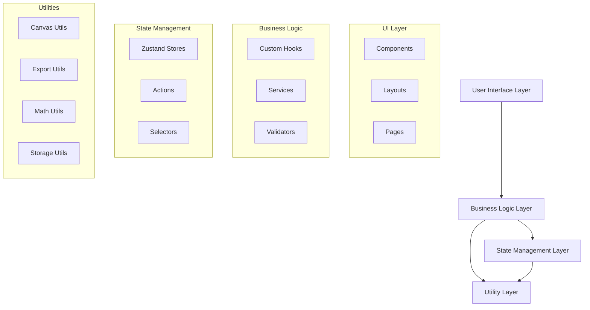
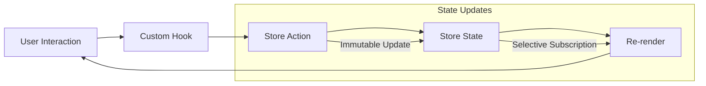

# Architecture Analysis Report
## 2D House Planner Application

**Analysis Date**: December 2024  
**Focus**: System design, patterns, and technical architecture  
**Scope**: Complete codebase architectural review

---

## Executive Summary

The 2D House Planner demonstrates **excellent architectural design** with modern React patterns, clean separation of concerns, and scalable structure. The application follows industry best practices with custom hooks, centralized state management, and modular component design.

**Architecture Grade**: A- (Excellent with minor improvements needed)

---

## 1. System Architecture Overview

### High-Level Architecture



### Technology Stack Analysis

| Layer | Technology | Version | Justification | Grade |
|-------|------------|---------|---------------|-------|
| **Framework** | Next.js | 15.3.5 | Modern React framework, SSR capability | A |
| **UI Library** | React | 19.1.0 | Latest stable, excellent ecosystem | A |
| **Language** | TypeScript | 5.x | Type safety, developer experience | A+ |
| **Canvas** | Konva.js | 9.3.22 | High-performance 2D canvas library | A |
| **State** | Zustand | 5.0.6 | Lightweight, performant state management | A |
| **Styling** | Tailwind CSS | 4.x | Utility-first, consistent design system | A |
| **Testing** | Jest | 29.7.0 | Industry standard (config issues noted) | B- |
| **Build** | Turbopack | Latest | Fast development builds | A |

---

## 2. Design Patterns Analysis

### 2.1 State Management Pattern (Zustand)

**Implementation Quality**: ✅ Excellent

```typescript
// Clean store definition with proper typing
export interface DesignState {
  walls: Wall[];
  doors: Door[];
  windows: Window[];
  selectedElementId: string | null;
  selectedElementType: ElementType | null;
}

export interface DesignActions {
  addWall: (wall: Wall) => void;
  updateWall: (id: string, updates: Partial<Wall>) => void;
  selectElement: (id: string | null, type: ElementType | null) => void;
}

// Store implementation with immutable updates
export const useDesignStore = create<DesignState & DesignActions>((set) => ({
  // State
  walls: [],
  doors: [],
  selectedElementId: null,
  
  // Actions with proper immutability
  addWall: (wall) => set((state) => ({
    walls: [...state.walls, wall],
  })),
  
  updateWall: (id, updates) => set((state) => ({
    walls: state.walls.map((wall) =>
      wall.id === id ? { ...wall, ...updates } : wall
    ),
  })),
}));
```

**Strengths**:
- ✅ Proper TypeScript integration
- ✅ Immutable state updates
- ✅ Clear separation of state and actions
- ✅ Minimal boilerplate compared to Redux
- ✅ Excellent performance with selective subscriptions

### 2.2 Custom Hooks Pattern

**Implementation Quality**: ✅ Excellent

```typescript
// Business logic encapsulation
export const useWallTool = () => {
  const [drawingState, setDrawingState] = useState<WallDrawingState>({
    isDrawing: false,
    startPoint: null,
    currentPoint: null,
  });

  const { walls } = useDesignStore();
  const { snapToGrid, gridSize } = useUIStore();

  // Encapsulated business logic
  const startDrawing = useCallback((x: number, y: number) => {
    const snapResult = snapPoint({ x, y }, gridSize, snapPoints, snapToGrid);
    setDrawingState({
      isDrawing: true,
      startPoint: { x: snapResult.x, y: snapResult.y },
      currentPoint: { x: snapResult.x, y: snapResult.y },
    });
  }, [gridSize, snapToGrid]);

  return {
    drawingState,
    startDrawing,
    updateDrawing,
    finishDrawing,
    cancelDrawing,
  };
};
```

**Strengths**:
- ✅ Single responsibility principle
- ✅ Reusable business logic
- ✅ Proper dependency management
- ✅ Clean API surface
- ✅ Testable in isolation

### 2.3 Command Pattern (Undo/Redo)

**Implementation Quality**: ✅ Excellent

```typescript
// Command interface
export interface Command {
  execute(): void;
  undo(): void;
  getDescription(): string;
}

// Concrete command implementation
export class UpdateWallCommand implements Command {
  constructor(
    private wallId: string,
    private oldWall: Wall,
    private newWall: Wall,
    private updateWall: (id: string, wall: Wall) => void
  ) {}

  execute(): void {
    this.updateWall(this.wallId, this.newWall);
  }

  undo(): void {
    this.updateWall(this.wallId, this.oldWall);
  }

  getDescription(): string {
    return `Update wall ${this.wallId}`;
  }
}

// History store with command pattern
export const useHistoryStore = create<HistoryState & HistoryActions>((set, get) => ({
  history: [],
  currentIndex: -1,
  
  executeCommand: (command: Command) => {
    command.execute();
    set((state) => ({
      history: [...state.history.slice(0, state.currentIndex + 1), command],
      currentIndex: state.currentIndex + 1,
    }));
  },
  
  undo: () => {
    const { history, currentIndex } = get();
    if (currentIndex >= 0) {
      history[currentIndex].undo();
      set({ currentIndex: currentIndex - 1 });
    }
  },
}));
```

**Strengths**:
- ✅ Proper command pattern implementation
- ✅ Supports complex undo/redo scenarios
- ✅ Extensible for new command types
- ✅ Memory efficient with command history

### 2.4 Factory Pattern (Element Creation)

**Implementation Quality**: ✅ Good

```typescript
// Element factory interface
export interface Element2DFactory {
  createWall: (startPoint: Point2D, endPoint: Point2D, thickness: number) => Wall2D;
  createDoor: (wallId: string, position: number, width: number) => Door2D;
  createWindow: (wallId: string, position: number, width: number) => Window2D;
}

// Factory implementation
export class DefaultElement2DFactory implements Element2DFactory {
  createWall(startPoint: Point2D, endPoint: Point2D, thickness: number): Wall2D {
    return {
      id: generateId(),
      type: 'wall2d',
      startPoint,
      endPoint,
      thickness,
      height: 240, // Default height
      materialId: 'default-wall-material',
      // ... other properties
    };
  }
  
  createDoor(wallId: string, position: number, width: number): Door2D {
    return {
      id: generateId(),
      type: 'door2d',
      wallId,
      positionOnWall: position,
      width,
      height: 200, // Default door height
      swingDirection: 'right',
      // ... other properties
    };
  }
}
```

**Strengths**:
- ✅ Consistent element creation
- ✅ Default value management
- ✅ Extensible for new element types
- ✅ Type-safe factory methods

---

## 3. Component Architecture

### 3.1 Component Hierarchy

```
src/components/
├── Layout/
│   └── AppLayout.tsx              # Main application layout
├── Canvas/
│   ├── DrawingCanvas.tsx          # Core canvas component
│   ├── elements/                  # Element renderers
│   │   ├── WallComponent.tsx
│   │   ├── DoorComponent.tsx
│   │   └── WindowComponent.tsx
│   ├── renderers/                 # View-specific renderers
│   │   ├── PlanViewRenderer2D.tsx
│   │   └── ElevationRenderer2D.tsx
│   └── overlays/                  # Canvas overlays
│       ├── Grid.tsx
│       ├── SnapIndicators.tsx
│       └── MeasurementDisplay.tsx
├── Properties/
│   ├── PropertiesPanel.tsx        # Main properties panel
│   ├── WallPropertiesPanel.tsx
│   └── RoomPropertiesPanel.tsx
├── Toolbar/
│   ├── Toolbar.tsx                # Main toolbar
│   ├── ToolButton.tsx
│   └── AlignmentTools.tsx
├── Materials/
│   ├── MaterialLibrary.tsx
│   ├── MaterialCard.tsx
│   └── MaterialEditor.tsx
└── Export/
    ├── ExportDialog.tsx
    └── ExportPreview.tsx
```

### 3.2 Component Design Principles

#### Single Responsibility Principle ✅
```typescript
// Each component has a clear, single purpose
const WallComponent = ({ wall, isSelected, onSelect }) => {
  // Only handles wall rendering and basic interactions
};

const WallPropertiesPanel = ({ wall, onUpdate }) => {
  // Only handles wall property editing
};
```

#### Composition over Inheritance ✅
```typescript
// Components compose smaller components
const DrawingCanvas = () => {
  return (
    <Stage>
      <Layer>
        <Grid />
        <WallRenderer walls={walls} />
        <DoorRenderer doors={doors} />
        <SnapIndicators />
        <MeasurementDisplay />
      </Layer>
    </Stage>
  );
};
```

#### Props Interface Design ✅
```typescript
// Well-defined, typed interfaces
interface WallComponentProps {
  wall: Wall;
  isSelected: boolean;
  isHovered: boolean;
  onSelect: (id: string) => void;
  onHover: (id: string | null) => void;
  onDragStart: (e: KonvaEventObject<DragEvent>) => void;
  onDragMove: (e: KonvaEventObject<DragEvent>) => void;
  onDragEnd: (e: KonvaEventObject<DragEvent>) => void;
}
```

---

## 4. State Management Architecture

### 4.1 Store Organization

```typescript
// Stores organized by domain
src/stores/
├── designStore.ts        # Core design elements (walls, doors, etc.)
├── uiStore.ts           # UI state (active tool, zoom, etc.)
├── viewStore.ts         # View management (current view, transitions)
├── floorStore.ts        # Multi-floor management
├── materialStore.ts     # Material library and assignments
├── templateStore.ts     # Design templates
├── historyStore.ts      # Undo/redo functionality
├── errorStore.ts        # Error state management
└── accessibilityStore.ts # Accessibility preferences
```

### 4.2 State Flow Analysis



### 4.3 Store Dependencies

```typescript
// Clean store dependencies
const useDesignStore = create<DesignState & DesignActions>((set, get) => ({
  // Floor-aware methods that depend on floorStore
  getCurrentFloorElements: () => {
    const floorStore = useFloorStore.getState(); // ✅ Explicit dependency
    const currentFloor = floorStore.getCurrentFloor();
    return currentFloor?.elements || getDefaultElements();
  },
  
  syncWithCurrentFloor: () => {
    const floorStore = useFloorStore.getState();
    const currentFloor = floorStore.getCurrentFloor();
    if (currentFloor) {
      set({
        walls: currentFloor.elements.walls,
        doors: currentFloor.elements.doors,
        // ... sync other elements
      });
    }
  },
}));
```

**Strengths**:
- ✅ Clear store boundaries
- ✅ Minimal cross-store dependencies
- ✅ Explicit dependency management
- ✅ Predictable state flow

---

## 5. Type System Architecture

### 5.1 Type Organization

```typescript
src/types/
├── elements2D.ts         # 2D element type definitions
├── elements/             # Individual element types
│   ├── Wall.ts
│   ├── Door.ts
│   └── Window.ts
├── materials/            # Material system types
│   ├── Material.ts
│   └── MaterialTemplate.ts
├── views.ts             # View system types
├── drawingSheet2D.ts    # Export and drawing sheet types
└── konva.ts             # Konva-specific type extensions
```

### 5.2 Type Design Quality

#### Base Element Interface ✅
```typescript
// Well-designed base interface
export interface Element2D {
  id: string;
  type: Element2DType;
  transform: Transform2D;
  dimensions: Dimensions2D;
  materialId?: string;
  floorId: string;
  visible: boolean;
  locked: boolean;
  metadata?: Record<string, unknown>;
}

// Proper type discrimination
export type Element2DType = 
  | 'wall2d' 
  | 'door2d' 
  | 'window2d' 
  | 'stair2d' 
  | 'roof2d';
```

#### Extending Base Types ✅
```typescript
// Proper inheritance with type discrimination
export interface Wall2D extends Element2D {
  type: 'wall2d';
  startPoint: Point2D;
  endPoint: Point2D;
  thickness: number;
  height: number;
  openings: Opening2D[];
  connectedWalls: string[];
}

export interface Door2D extends Opening2D {
  type: 'door2d';
  swingDirection: 'left' | 'right';
  swingAngle: number;
  handleSide: 'left' | 'right';
}
```

#### Utility Types ✅
```typescript
// Helpful utility types
export type Element2DCollection = {
  walls: Wall2D[];
  doors: Door2D[];
  windows: Window2D[];
  stairs: Stair2D[];
  roofs: Roof2D[];
  rooms: Room2D[];
};

// Factory interface for type safety
export interface Element2DFactory {
  createWall: (startPoint: Point2D, endPoint: Point2D) => Wall2D;
  createDoor: (wallId: string, position: number) => Door2D;
}
```

**Strengths**:
- ✅ Comprehensive type coverage
- ✅ Proper inheritance hierarchies
- ✅ Type discrimination for unions
- ✅ Utility types for common patterns

---

## 6. Module Architecture

### 6.1 Import/Export Strategy

```typescript
// Clean barrel exports
// src/components/ui/index.ts
export { Button } from './button';
export { Input } from './input';
export { Select } from './select';
export { Card } from './card';

// Proper path aliases
// tsconfig.json
{
  "compilerOptions": {
    "paths": {
      "@/*": ["./src/*"]
    }
  }
}

// Usage with clean imports
import { Button, Input } from '@/components/ui';
import { useDesignStore } from '@/stores/designStore';
import { Wall } from '@/types/elements/Wall';
```

### 6.2 Dependency Management

```typescript
// Good: Explicit dependencies in custom hooks
export const useWallTool = () => {
  const { walls } = useDesignStore();           // State dependency
  const { snapToGrid } = useUIStore();          // UI dependency
  const { addWallWithIntersection } = useWallIntersection(); // Logic dependency
  
  // Hook logic...
};

// Good: Utility functions with no external dependencies
export function snapPoint(
  point: Point2D,
  gridSize: number,
  snapPoints: Point2D[],
  enableSnap: boolean
): SnapResult {
  // Pure function with explicit parameters
}
```

**Strengths**:
- ✅ Clear dependency boundaries
- ✅ Minimal circular dependencies
- ✅ Pure utility functions
- ✅ Explicit parameter passing

---

## 7. Performance Architecture

### 7.1 Rendering Optimization

```typescript
// Efficient canvas rendering with Konva
const WallComponent = React.memo(({ wall, isSelected }) => {
  // Memoized component prevents unnecessary re-renders
  return (
    <Group>
      <Rect
        x={wall.startX}
        y={wall.startY}
        width={wall.length}
        height={wall.thickness}
        fill={wall.color}
        listening={true} // Only enable events when needed
      />
    </Group>
  );
});

// Selective store subscriptions
const useWallRenderer = () => {
  const walls = useDesignStore(state => state.walls); // ✅ Only subscribe to walls
  const selectedId = useDesignStore(state => state.selectedElementId);
  
  // Component only re-renders when walls or selection changes
};
```

### 7.2 State Update Optimization

```typescript
// Efficient state updates with Zustand
const useDesignStore = create<DesignState & DesignActions>((set) => ({
  updateWall: (id, updates) =>
    set((state) => {
      // Only update if wall actually exists
      const wallIndex = state.walls.findIndex(w => w.id === id);
      if (wallIndex === -1) return state;
      
      // Create new array only if needed
      const newWalls = [...state.walls];
      newWalls[wallIndex] = { ...newWalls[wallIndex], ...updates };
      
      return { walls: newWalls };
    }),
}));
```

### 7.3 Memory Management

```typescript
// Proper cleanup in useEffect hooks
useEffect(() => {
  const handleKeyDown = (e: KeyboardEvent) => {
    // Event handler logic
  };

  window.addEventListener('keydown', handleKeyDown);
  
  // ✅ Always clean up event listeners
  return () => {
    window.removeEventListener('keydown', handleKeyDown);
  };
}, []);

// Canvas cleanup
useEffect(() => {
  const stage = stageRef.current;
  
  return () => {
    // ✅ Clean up Konva resources
    stage?.destroy();
  };
}, []);
```

---

## 8. Error Handling Architecture

### 8.1 Current Error Handling

```typescript
// Current approach (needs improvement)
try {
  await saveDesign();
} catch (error) {
  console.error('Error saving design:', error); // ❌ Poor UX
}
```

### 8.2 Recommended Error Architecture

```typescript
// Error boundary for React errors
class CanvasErrorBoundary extends React.Component {
  constructor(props) {
    super(props);
    this.state = { hasError: false, error: null };
  }

  static getDerivedStateFromError(error) {
    return { hasError: true, error };
  }

  componentDidCatch(error, errorInfo) {
    logError('Canvas error', error, errorInfo);
  }

  render() {
    if (this.state.hasError) {
      return <ErrorFallback error={this.state.error} />;
    }
    return this.props.children;
  }
}

// Centralized error handling
export const useErrorHandler = () => {
  const { addError } = useErrorStore();
  
  const handleError = useCallback((error: Error, context: string) => {
    // Log for debugging
    logError(context, error);
    
    // Show user-friendly message
    addError({
      id: generateId(),
      message: getErrorMessage(error),
      type: 'error',
      context,
      timestamp: Date.now(),
    });
  }, [addError]);
  
  return { handleError };
};
```

---

## 9. Testing Architecture

### 9.1 Current Testing Setup

```javascript
// jest.config.js - Has configuration issues
module.exports = {
  preset: 'ts-jest',
  testEnvironment: 'jsdom',
  transform: {
    '^.+\\.tsx?$': 'babel-jest', // ❌ Missing Babel config
  },
  // ... rest of config
};
```

### 9.2 Recommended Testing Strategy

```typescript
// Unit tests for utilities
describe('snapPoint', () => {
  it('should snap to grid when enabled', () => {
    const result = snapPoint({ x: 15, y: 25 }, 10, [], true);
    expect(result).toEqual({ x: 20, y: 30, snapped: true });
  });
});

// Integration tests for hooks
describe('useWallTool', () => {
  it('should create wall with proper snapping', () => {
    const { result } = renderHook(() => useWallTool());
    
    act(() => {
      result.current.startDrawing(15, 25);
      result.current.finishDrawing();
    });
    
    // Verify wall was created with snapped coordinates
  });
});

// Component tests with React Testing Library
describe('WallComponent', () => {
  it('should render wall with correct dimensions', () => {
    const wall = createTestWall();
    render(<WallComponent wall={wall} />);
    
    // Test rendering and interactions
  });
});
```

---

## 10. Scalability Analysis

### 10.1 Current Scalability Strengths

- ✅ **Modular Architecture**: Easy to add new element types
- ✅ **Type Safety**: Prevents runtime errors as codebase grows
- ✅ **Clean Abstractions**: Well-defined interfaces and contracts
- ✅ **Performance**: Efficient rendering and state management

### 10.2 Scalability Considerations

```typescript
// Easy to extend with new element types
interface Furniture2D extends Element2D {
  type: 'furniture2d';
  furnitureType: 'chair' | 'table' | 'bed';
  // ... furniture-specific properties
}

// Factory pattern supports new types
class ExtendedElement2DFactory extends DefaultElement2DFactory {
  createFurniture(type: FurnitureType, position: Point2D): Furniture2D {
    // Implementation for new element type
  }
}

// Store can be extended for new domains
export const useFurnitureStore = create<FurnitureState & FurnitureActions>((set) => ({
  furniture: [],
  addFurniture: (item) => set((state) => ({
    furniture: [...state.furniture, item],
  })),
}));
```

---

## 11. Security Architecture

### 11.1 Current Security Posture

**Strengths**:
- ✅ **Client-side only**: Reduces server-side attack surface
- ✅ **Type safety**: Prevents many injection vulnerabilities
- ✅ **No authentication**: Eliminates auth-related vulnerabilities

**Considerations**:
- ⚠️ **Local storage**: Design data stored in browser
- ⚠️ **File uploads**: Template imports should validate file types
- ⚠️ **Export functions**: PDF generation should sanitize inputs

### 11.2 Security Recommendations

```typescript
// Input validation for file uploads
const validateTemplateFile = (file: File): boolean => {
  // Check file type
  if (!file.type.includes('json')) {
    throw new Error('Invalid file type');
  }
  
  // Check file size
  if (file.size > MAX_TEMPLATE_SIZE) {
    throw new Error('File too large');
  }
  
  return true;
};

// Sanitize data before PDF export
const sanitizeForPDF = (text: string): string => {
  return text
    .replace(/[<>]/g, '') // Remove potential HTML
    .substring(0, MAX_TEXT_LENGTH); // Limit length
};
```

---

## 12. Recommendations

### 12.1 Immediate Improvements (High Priority)

1. **Fix Jest Configuration**
   - Add proper Babel configuration
   - Enable comprehensive testing

2. **Complete Missing Implementations**
   - Element movement functionality
   - Keyboard navigation system

3. **Improve Error Handling**
   - Replace console.error with user notifications
   - Add error boundaries

### 12.2 Medium-term Improvements

1. **Performance Optimization**
   - Canvas virtualization for large designs
   - Implement element pooling

2. **Architecture Enhancements**
   - Add plugin system for extensibility
   - Implement event bus for loose coupling

3. **Testing Strategy**
   - Achieve >80% test coverage
   - Add E2E tests for critical workflows

### 12.3 Long-term Considerations

1. **Scalability Preparation**
   - Consider micro-frontend architecture
   - Plan for real-time collaboration features

2. **Performance Monitoring**
   - Add performance metrics collection
   - Implement error tracking

---

## Conclusion

The 2D House Planner demonstrates **excellent architectural design** with modern React patterns, clean separation of concerns, and professional-grade implementation. The codebase is well-structured, type-safe, and follows industry best practices.

**Architecture Strengths**:
- ✅ Clean, modular design
- ✅ Excellent TypeScript implementation
- ✅ Proper state management patterns
- ✅ Scalable component architecture
- ✅ Performance-conscious implementation

**Areas for Improvement**:
- ❌ Testing infrastructure needs fixes
- ❌ Some missing core implementations
- ⚠️ Error handling could be enhanced

**Overall Assessment**: The architecture provides a solid foundation for a production-ready application with minor improvements needed in testing and error handling.